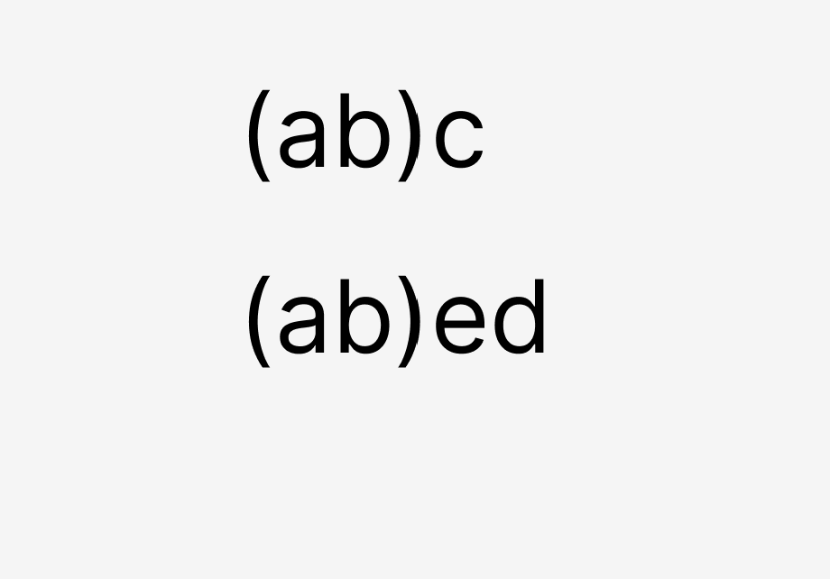

# 双端对比算法更新children

双端对比算法锁定中间乱序的部分的。

- 处理左侧
- 处理右侧
- 左侧一样（新的比老的长）把新创建的添加到尾部
- 右侧一样 (新的比老的长) 把新创建的添加到头部
- 左侧 老的比新的长 （删除）
- 右侧 老的比新的长 （删除）
- 中间对比
  - 创建新的 (在老的里面不存在，新的里面存在)
  - 删除老的 (在老的里面存在,新的里面不存在)
  - 移动 (在老的里面存在，新的里面也存在)

