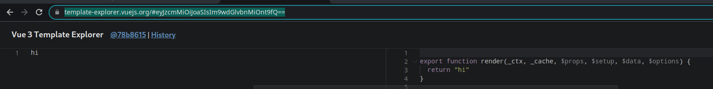

# 实现代码生成string

这个小节的目标就是通过我们的ast树来生成我们的可运行代码的一个阶段
我们最终要实现的目标就是编译我们的string 类型为一个函数可执行的函数
[template explorer vue](https://template-explorer.vuejs.org/#eyJzcmMiOiJoaSIsIm9wdGlvbnMiOnt9fQ==)

我们期待我们的输出一个render 方法 像这样



然后我们可以去代码里面去伪实现一下，让测试通过.

但是这一小节我并不打算贴好多代码来进行逻辑的阐述，因为这个功能实在是很简单，但是这里的逻辑要封装成一个可复用，可拓展的逻辑还是需要好好设计一下的

下面就让我们来跟着写好的代码一起来感受一下如何设计这一块的代码，以及各个模块之间的功能划分

测试代码

```typescript
import { generator } from "../src/codegen";
import { baseParse } from "../src/parse";
import { transform } from "../src/transform";

describe('codeGen', () => {
    it("string",() => { 
        const ast=baseParse("hi");

        transform(ast)

        const {code}=generator(ast)

        expect(code).toMatchSnapshot()
        
     })
});
```

主要代码实现逻辑

```typescript
export function generator(ast) {
  const context = createCodegenContext();
  const { push } = context;
  const args = ["_ctx", "_cache"];
  push("return ");
  const functionName = "render";
  const signature = args.join(", ");

  push(`function ${functionName}(${signature}){`);
  push("return ");
  genNode(ast.codegenNode, context);
  push("}");
  return {
    code: context.code,
  };
}

function genNode(node: any, context: any) {
  const { push } = context;
  push(`'${node.content}'`);
}

function createCodegenContext() {
  const context = {
    code: "",
    push(source) {
      context.code += source;
    },
  };
  return context;
}


// return function render(_ctx,cache){
// return "hi"
// }
```

1. 在测试的时候通过transform(ast) 处理ast 来得到经过transform函数处理过的ast;这个时候ast树上面就挂载了我们需要处理的codegenNode这个节点；做这个操作是因为，在generator 这个函数中，只处理ast 相关的逻辑，但是我们的层级结构是有点复杂的，我们要很了解这个层级结构才知道我们该处理的那个dom节点到底是那一个，所以我们就可以先在transform 里面先处理我们的ast树，然后挂载相应的需要的属性，然后再传入到generator 里面进行处理

2. 在进行函数处理的时候抽离出我们需要的内容，然后以及处理对象需要用到的方法，然后再去简便的处理这个内容

    ```typescript
    const context = createCodegenContext();

    const { push } = context;
    function createCodegenContext() {
    const context = {
        code: "",
        push(source) {
        context.code += source;
        },
    };
    return context;
    }
    ```

3. 处理函数名以及函数参数

    ```typescript
    const args = ["_ctx", "_cache"];

    const functionName = "render";
    const signature = args.join(", ");

    push(`function ${functionName}(${signature}){`);
    ```

4. 处理函数主体逻辑

    ```typescript
    push("return ");
    genNode(ast.codegenNode, context);
    push("}");
    function genNode(node: any, context: any) {
    const { push } = context;
    push(`'${node.content}'`);
    }
    ```

> Note 

- 这一小节还介绍了测试的调试技巧中的 *toMatchSnapshot* 的用法
- 核心的点是ast树转化逻辑的迁移到transform
- 代码的核心技术手段有生成context，以及处理context 的方法方便全局调用
- 代码的核心技术手段还有参数的数组化，方便拓展
- 代码的核心手段 拆分处理node 的函数体逻辑(genNode)，方便以后拓展
