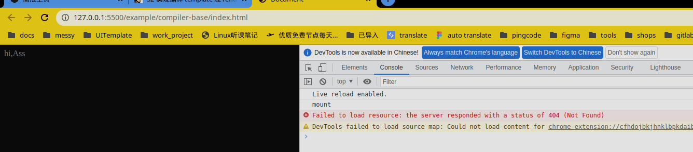

# 实现编译template 成render函数并渲染到页面上

- 编译template 是在声明式组件没有传递我们的render函数的时候的操作
- 简单一点就是我们替换掉我们的component 的render函数就行了
- 为了解耦不能直接调用我们的complier 函数然后返回函数主题逻辑直接赋值给我们的component的render 函数

1. 处理我们的complier-core 的导出逻辑到全局的Vue 出口

    ```typescript
    //compile.ts
    import { generator } from "./codegen";
    import { baseParse } from "./parse";
    import { transform } from "./transform";
    import transformElement from "./transforms/transformElement";
    import { transformExpression } from "./transforms/transformExpression";
    import { transformText } from "./transforms/transformText";

    export function baseCompile(template){
        const ast: any = baseParse(template);
        transform(ast, {
        nodeTransforms: [transformExpression, transformElement, transformText],
        });
        return generator(ast);
    }
    //index.ts
    export * from "./compile";
    ```

2. 在我们的component 模块申明compiler 状态以及注册compiler 函数的方法

    ```typescript
    //注册组件，在index里面去调用注册我们的compiler；
    let compiler;
    export function registerRuntimeCompiler(_compiler) {
    compiler = _compiler;
    }


    ```

3. 在入口处注册我们的compiler

    ```typescript
    function compileToFunction(template) {
    const { code } = baseCompile(template);
    //这里的code 就是我们代码compile 生成的代码；第一个参数是我们的函数参数
    const render = new Function("Vue", code)(runtimeDom);
    return render;
    }

    registerRuntimeCompiler(compileToFunction);


    ```

4. 在我们的component里面去使用我们注册好了的compiler 函数来重新生成我们的render 函数

    ```typescript
    function finishComponentSetup(instance) {
    const Component = instance.type;
    //假设是一定有render的
    //在这里去调用我们的render 函数
    //但是如果在这里面去引用我们的complier 模块的东西，这样会造成依赖的循环依赖；vue 是可以直接存在于运行时的，如果引入了complier 模块的话就不干净了；
    //注册了compiler 然后在这里使用
    if (compiler && !Component.render) {
        if (Component.template) {
        Component.render = compiler(Component.template);
        }
    }

    instance.render = Component.render;
    }
    ```

然后我们还需要去声明一下我们解析需要用到的toDisplayString 和createElementVNode函数

bingo:

然后你就会在页面上看见这，努力了两个月的成果，



>Note: 话不多说，找崔哥拿书
